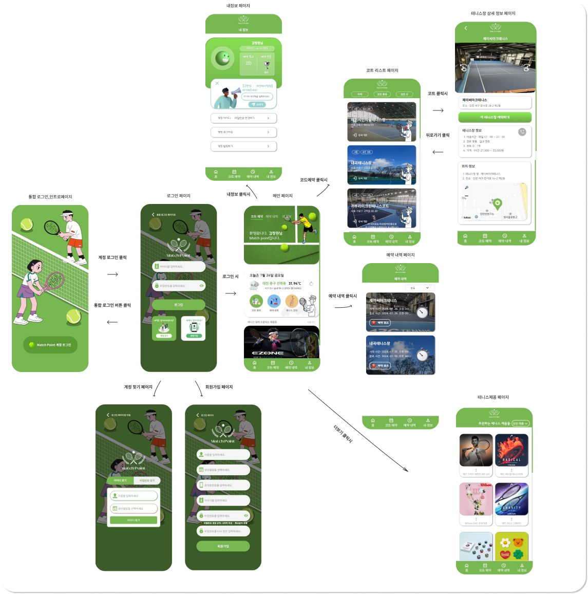

# Match_Point

---

## 1. 프로젝트 개요
- **프로젝트 이름:** Match_Point
- **목표:** 포트폴리오용 테니스 코트 예약 사이트
- **타겟 사용자:** 20 ~ 30대

---

## 2. 기능
- **핵심 기능:** 로컬스토리지를 이용한 회원가입, 로그인 시스템과 예약 시스템 등
- **추가 기능:** 메인 페이지의 API를 이용하여 현재 위치 정보의 날씨 표시, 각종 데이터를 이용하여 테니스장의 정보 표시 등

---

## 3. 프로토타입

- **프로토타입:** 위의 이미지를 통해 대략적인 프로토타입을 이해하실수 있습니다. 그 외 나머지 기능들 및 ui는 다운로드 하여 확인가능합니다.

--- 

## 4. etc
- **플랫폼:** 모바일 웹
- **사용 기술:** react, js, css, html
- **개발 인원:** front end 1명

---

## 5. 설명
- **설명:** 해당 프로젝트 Match_Point는 포트폴리오용으로 테니스 모바일 앱을 제작해봤습니다. 로컬스토리지와 weather api, kakao api, Emailjs, 테니스장 데이터를 활용하여 회원가입,로그인 및 피드백, 예약 시스템을 구축하였습니다. 더 자세한 내용은 https://changhyoun.github.io/Match_Point/를 통해 확인가능합니다.

